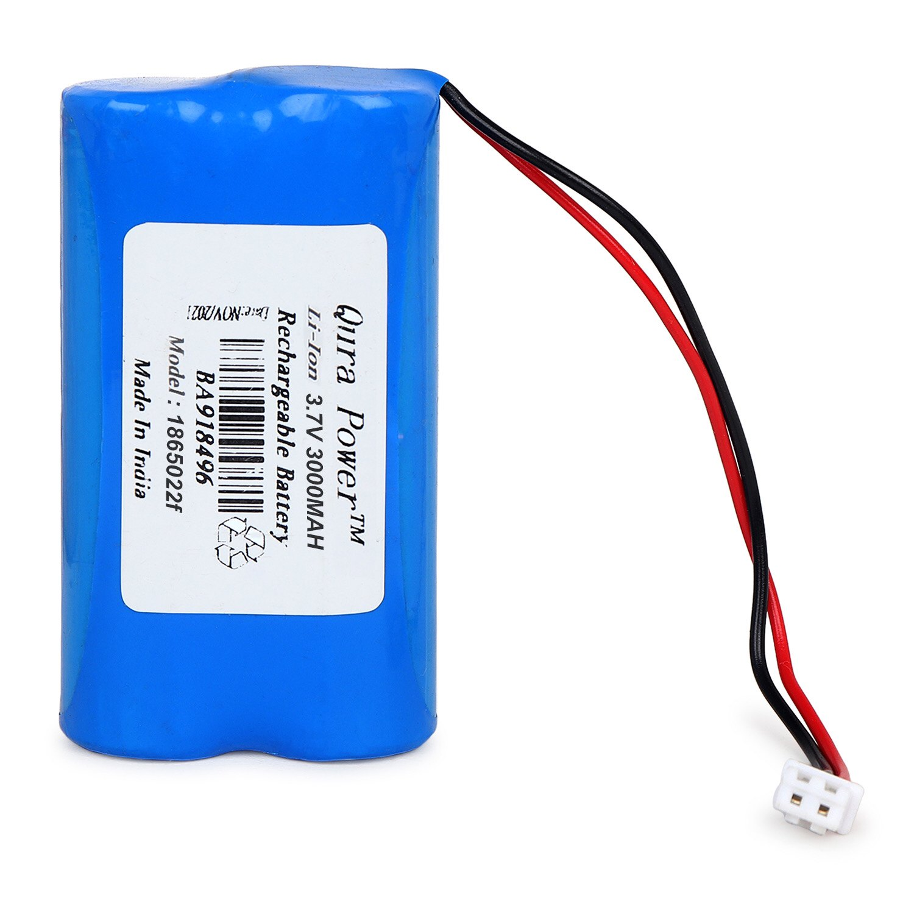
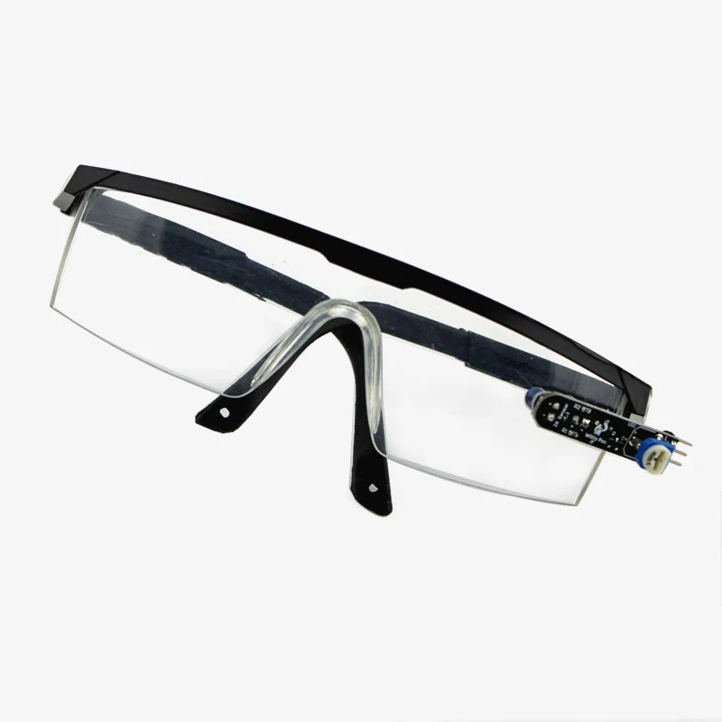
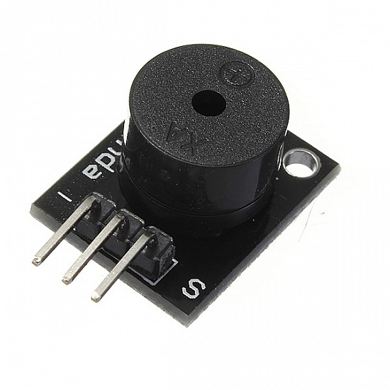
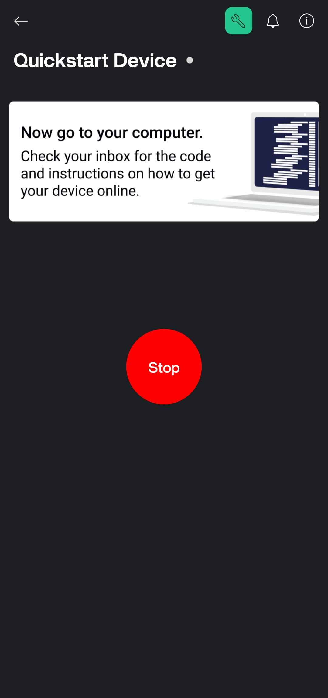
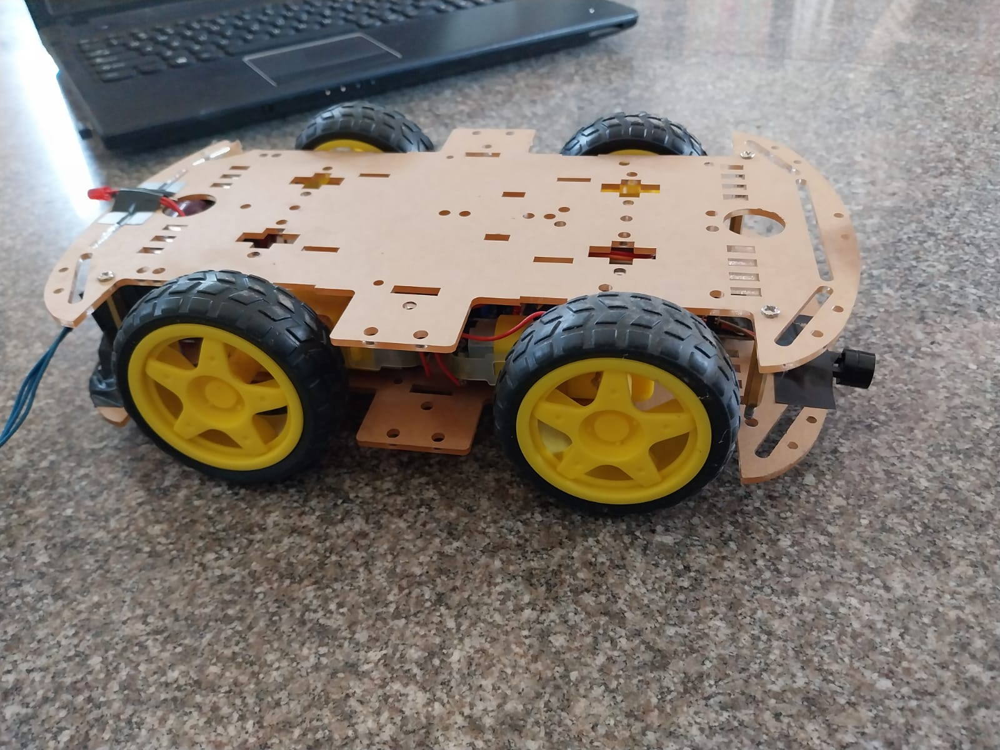
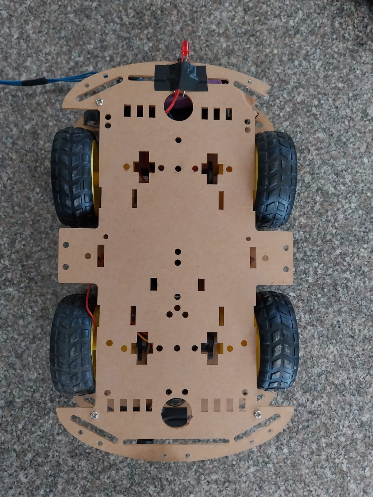

# IoT Fatigue Detection System for Vehicles

## Project Description
The IoT Fatigue Detection System is designed to enhance vehicle safety by automatically stopping the vehicle if the driver shows signs of fatigue or falls asleep. This system utilizes an eye blink sensor connected to a Node MCU ESP8266 to monitor the driver's alertness. The project integrates a mobile app via Blynk for remote control and monitoring, ensuring safety on the road.

## Components Used

1. **Node MCU ESP8266**  

   
   
   A low-cost open-source IoT platform based on the ESP8266 Wi-Fi module, allowing for easy integration with Wi-Fi networks.

3. **BO Motor**  

   
   
   Used to control the movement of the vehicle, receiving commands from the Node MCU to start or stop.

5. **3.7V Lithium-Ion Battery**  

   
   
   Provides power to the Node MCU and other components for portability.

7. **Eye Blink Sensor**  

    
   
   Detects eye movements and blinks to monitor driver alertness.

9. **LED**  

   
   
   Provides visual feedback indicating the system's status (active or inactive).

11. **Buzzer**  

   
   
   Alerts the driver if fatigue is detected, ensuring immediate attention.

11. **Jumper Wires**  

   
   
   Used for connecting components on a breadboard or directly to the Node MCU.

## Circuit Diagram

  

Illustrates how the components are interconnected, including the Node MCU, eye blink sensor, motor, LED, and buzzer.

## Blynk App Interface
### Blynk App Screenshots

 

Provides a user-friendly interface to control and monitor the vehicle's status remotely.

## Installation Instructions
1. **Install Arduino IDE**: Download and install the Arduino IDE from the [official website](https://www.arduino.cc/en/software).
2. **Install Blynk Library**: Open the Arduino IDE and go to `Sketch` > `Include Library` > `Manage Libraries`. Search for the Blynk library and install it.
3. **Install ESP8266 Board**: Go to `File` > `Preferences`, and add the following URL to the `Additional Board Manager URLs` field:  
   `http://arduino.esp8266.com/stable/package_esp8266com_index.json`  
   Then go to `Tools` > `Board` > `Boards Manager`, search for "ESP8266", and install it.
4. **Connect Hardware**: Follow the circuit diagram to connect all components to the Node MCU.
5. **Upload Code**: Open the provided code in the Arduino IDE, update the Wi-Fi credentials and Blynk authentication token, and upload it to the Node MCU.

## Usage
1. Power the circuit with the 3.7V Lithium-Ion battery.
2. Open the Blynk app and connect to the vehicle system.
3. Use the app to start or stop the vehicle remotely.
4. The eye blink sensor will continuously monitor the driver's alertness.

This code connects the Node MCU to Wi-Fi, integrates with the Blynk app, and controls the relay and buzzer based on the eye blink sensor's input.

## Output

  

The image above shows the final IoT car setup that utilizes the eye blink sensor for fatigue detection.

## Conclusions
The IoT Fatigue Detection System is a vital step toward improving road safety by providing an automatic mechanism to prevent accidents caused by driver fatigue. The integration of mobile technology via the Blynk app enhances user interaction and control, making the system more accessible and effective.
